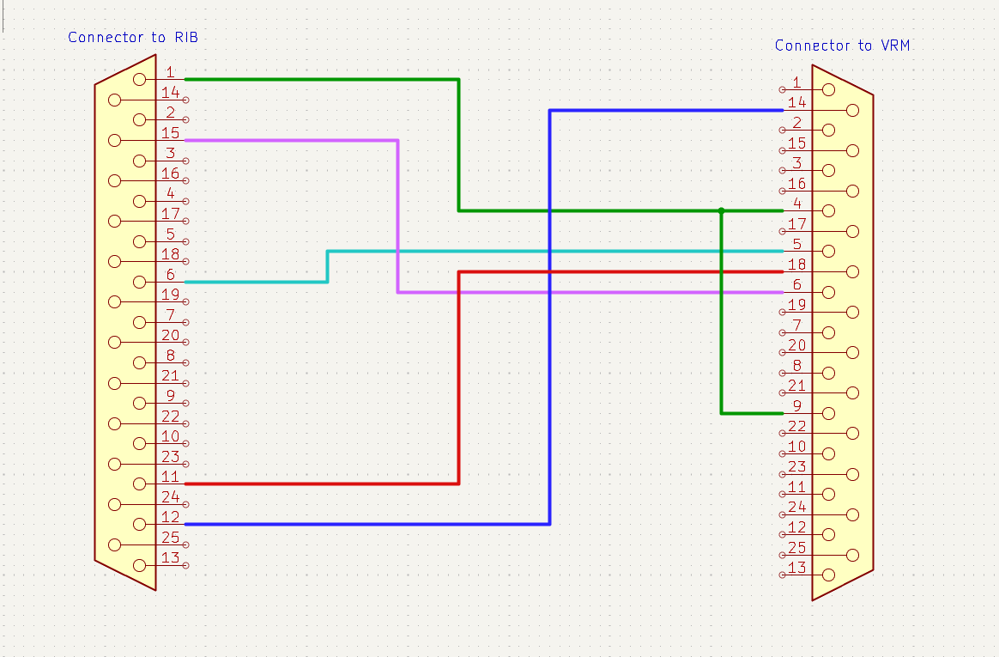

# Wiring

This section of the guide will go over how to wire up the various cables and interconnects required to power, program, and control the radios.

---

## Table of Contents
* [Part 0: Tools Required](#part-0-tools-required)
* [Part 1: Power Cables](#part-1-power-cables)
* [Part 2: Programming Cable](#part-2-programming-cable)
* [Part 3: MMDVM Cables](#part-3-mmdvm-cables)
* [Part 4: Front Panel Cables (Optional)](#part-4-front-panel-cables-optional)

---

## Part 0: Tools Required

---

## Part 1: Power Cables

---

## Part 2: Programming Cable

The programming cable for the VRM radio is comprised of 3 parts:
* VRM to RIB cable
* RIB with DB9 Serial Cable
* Serial to USB Converter Cable

Thankfully, the only thing we need to assemble is the VRM to RIB cable, as that's the only generally unavailable part.

Parts required:
* **2** - DB25 Female Connectors
* Any length of 5 (or more) conductor cable
    * I used an old chunk of CAT5 and used 5 of the 8 conductors. Really anything should work well for what we're doing.

### Assembly Steps
1. Before beginning soldering, take the DB25 for the VRM and bend the side tabs toward the back of the connector. This is required to make the connector to fit into the body of the radio.
    * [Image here]
2. Solder the cable to both connectors following the schematic, with connected pin numbers in the table:

    

    | RIB Connector | VRM Connector | Schematic Color |
    |---|---|---|
    | Pin 1 | Pins 4 & 9 | Green |
    | Pin 6 | Pin 5 | Teal |
    | Pin 11 | Pin 18 | Red |
    | Pin 12 | Pin 14 | Blue |
    | Pin 15 | Pin 6 | Magenta |

    **Note**: Make sure pins 4 and 9 are connected to eachother on the VRM side, otherwise the radio will enter emergency mode and will not respond to any buttons or programming.

---

## Part 3: MMDVM Cables

---

## Part 4: Front Panel Cables (Optional)