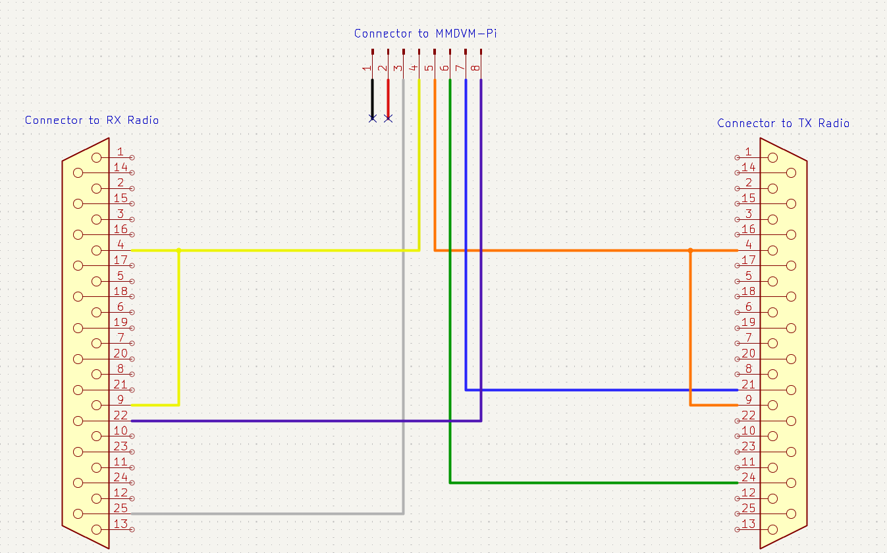
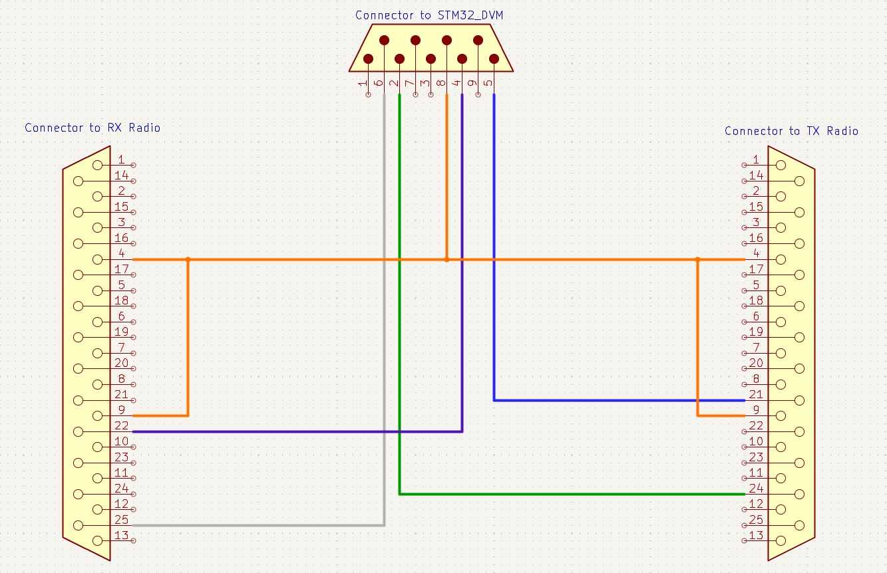

# Wiring

This section of the guide will go over how to wire up the various cables and interconnects required to power, program, and control the radios.

---

## Table of Contents
* [Part 0: Tools Required](#part-0-tools-required)
* [Part 1: Power Cables](#part-1-power-cables)
* [Part 2: Programming Cable](#part-2-programming-cable)
* [Part 3: MMDVM Cables](#part-3-mmdvm-cables)
* [Part 4: Front Panel Cables (Optional)](#part-4-front-panel-cables-optional)

---

## Part 0: Tools Required

---

## Part 1: Power Cables

---

## Part 2: Programming Cable

The programming cable for the VRM radio is comprised of 3 parts:
* VRM to RIB cable
* RIB with DB9 Serial Cable
* Serial to USB Converter Cable

Thankfully, the only thing we need to assemble is the VRM to RIB cable, as that's the only generally unavailable part.

Parts required:
* **2** - DB25 Female Connectors
* Any length of 5 (or more) conductor cable
    * I used an old chunk of CAT5 and used 5 of the 8 conductors. Really anything should work well for what we're doing.

#### Assembly Steps
1. Before beginning soldering, take the DB25 for the VRM and bend the side tabs toward the back of the connector. This is required to make the connector to fit into the body of the radio.
    * [Image here]
2. Solder the cable to both connectors following the schematic, with connected pin numbers in the table:

    

    | RIB Connector | VRM Connector | Sch. Color |
    |---|---|---|
    | Pin 1 | Pins 4 & 9 | Green |
    | Pin 6 | Pin 5 | Teal |
    | Pin 11 | Pin 18 | Red |
    | Pin 12 | Pin 14 | Blue |
    | Pin 15 | Pin 6 | Magenta |

    **Note**: Make sure pins 4 and 9 are connected to eachother on the VRM side, otherwise the radio will enter emergency mode and will not respond to any buttons or programming.

---

## Part 3: MMDVM Cables

As there are multiple options for wiring up the MMDVM, this part will be split into two parts, one for the [MMDVM-Pi](#mmdvm-pi), and one for the [STM32_DVM](#stm32_dvm).

Parts required:
* **2** - DB25 Female Connectors
* For MMDVM-Pi:
    * **1** - Included Interface Cable
* For STM32_DVM:
    * **~2 ft** - 6 Conductor Ribbon Cable
    * **1** - DB9 Male Connector with Housing

#### MMDVM-Pi

1. Follow [Step 1 in Part 2](#assembly-steps) with 2 of the DB25 connectors, one for the RX radio and one for the TX radio.
2. Using the cable provided with the MMDVM-Pi, follow the schematic shown to connect the DB25 connectors. Connected pin numbers are in the table. Make sure pins 4 and 9 are connected together.
    
    

    | MMDVM-Pi | RX Radio | TX Radio | Pin Disc. | Wire Color |
    |---|---|---|---|---|
    | Pin 1 | N/C | N/C | CTRL | Black |
    | Pin 2 | N/C | N/C | COS | Red |
    | Pin 3 | Pin 25 |  | RX Audio | White |
    | Pin 4 | Pins 4 & 9 |  | Ground | Yellow |
    | Pin 5 |  | Pins 4 & 9 | Ground | Orange |
    | Pin 6 |  | Pin 24 | TX Audio | Green |
    | Pin 7 |  | Pin 21 | PTT | Blue |
    | Pin 8 | Pin 22 |  | RSSI | Purple |

#### STM32_DVM

1. Follow [Step 1 in Part 2](#assembly-steps) with 2 of the DB25 connectors, one for the RX radio and one for the TX radio.
2. Using the piece of ribbon cable and the DB9 male connector, follow the schematic shown to connect the DB25 connectors. Connected pin numbers are in the table. Make sure pins 4 and 9 are connected together.
    
    

    | STM32_DVM | RX Radio | TX Radio | Pin Disc. | Sch. Color |
    |---|---|---|---|---|
    | Pin 1 | | | N/C | N/A |
    | Pin 2 | | Pin 24 | TX Audio | Green |
    | Pin 3 | N/C | N/C | Inhibit | N/A |
    | Pin 4 | Pin 22 |  | RSSI | Purple |
    | Pin 5 |  | Pin 21 | PTT | Blue |
    | Pin 6 | Pin 25 |  | RX Audio | Grey |
    | Pin 7 | | | N/C | N/A |
    | Pin 8 | Pins 4 & 9 | Pins 4 & 9 | Ground | Orange |
    | Pin 9 | N/C | N/C | VIN | N/A |

---

## Part 4: Front Panel Cables (Optional)